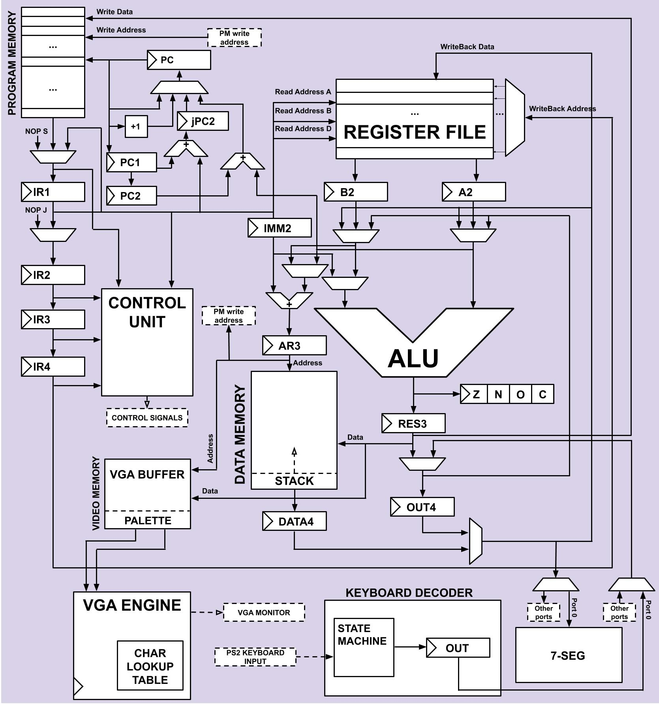

# TSEA83 Hardware
Repository for the hardware structure for TSEA83 project.

## Block diagram
 

## Pipeline CPU
Information about the Pipeline CPU architecture.

### Components 
* Program memory component
* Control Unit
* ALU
* Data memory component
* Register File

## VGA Monitor Engine

## PS2 UART Keyboard Decoder

 
